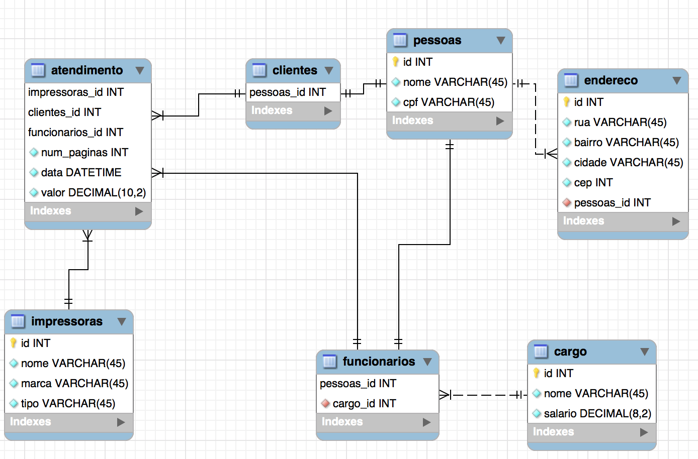
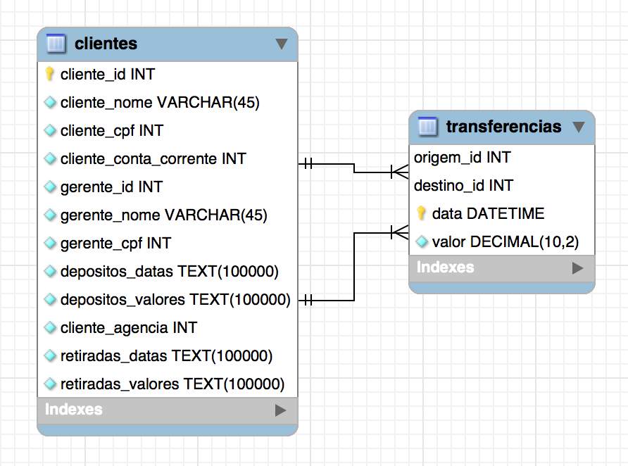

# Prova Banco de Dados 02

**Desenvolvimento de Aplicações Web -- 2016**

**Professor: João Eduardo Montandon**

**Valor: 10 Pontos**

## Copiadora Copyleft (XX pontos)

A Copiadora Copyleft é uma empresa que atua no ramo de impressão de documentos. O gerente da empresa está fazendo o relatório anual de faturamento e precisa de algumas informações sobre como foi o desempenho da empresa ao longo dos meses. 

Como toda a logística da empresa é registrada em um sistema, a empresa contratou seus serviços para obter as seguintes informações:

1. Listar nome, marca e tipo de todas as impressoras existentes
2. Listar o nome, cargo, e salário de cada funcionário
3. Listar as cidades dos clientes onde houve atendimento
4. Listar os detalhes de todos os atendimentos presentes
5. Listar o nome dos clientes que foram atendidos em dezembro de 2015
6. Listar a média de ganhos dos funcionários
7. Listar quantas cópias cada impressora imprimiu no último ano
8. Listar o faturamento anual da empresa (anos mais recentes primeiro)
9. Listar o faturamento mensal da empresa (meses mais recente primeiro)
10. Listar os funcionários mais lucrativos (aqueles que venderam mais nos atendimentos)
11. Listar a quantidade de atendimentos realizados por funcionário, por mês, em ordem descrescente.
12. Listar o funcionário do mês -- o quanto vendeu e quantos antedimentos fez -- de cada mês do último ano (o funcionário do mês é aquele que mais vendou no período).

Elabore as consultas que recupere as informações desejadas com base no DER abaixo: 

## Normalização (xx pontos)

Você recebeu da sua empresa o seguinte DER:

É fácil observar que esse DER possui vários problemas de design que, no decorrer do tempo, podem prejudicar a integridade dos dados. Você deverá identificar as inconsitências e corrigí-las de forma a obter um modelo normalizado da estrutura. 

Você deverá relatar a sequência de passos executados para a normalização e documentar -- através de um screenshot -- como ficou a estrutura após execução de cada passo.